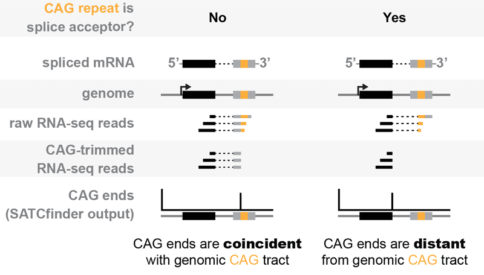
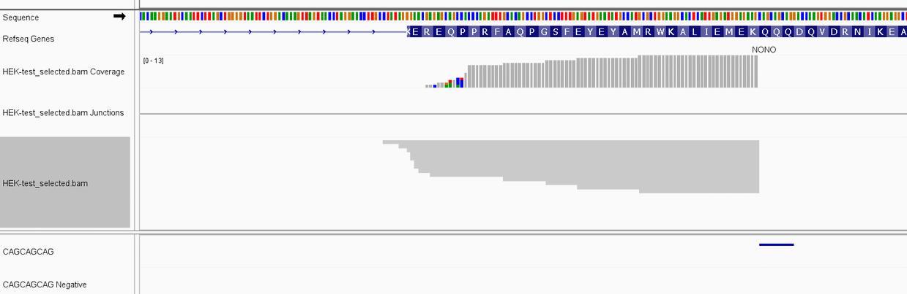
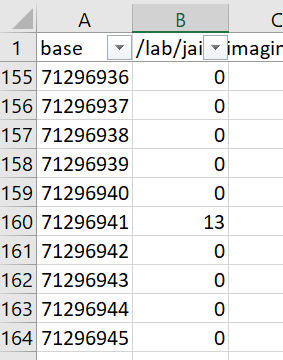
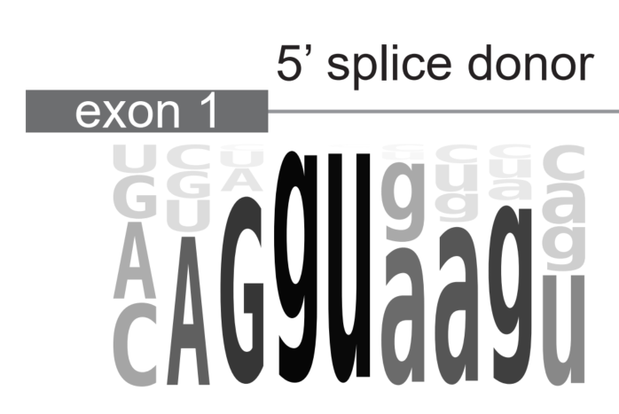

# SATCfinder
SATCfinder is an RNA-Sequencing pipeline designed for detection of **S**plicing **A**t **T**andem **C**AG repeat tracts. 
Although designed for CAG repeats, SATCfinder's scripts may be useful for any sort of tandem repeats. 

## What SATCfinder does
To find splice junctions in RNA-seq, you need reads which span the junction and have at least a few bases in each exon. 
In cases where a tandem CAG repeat is acting as the splice acceptor, the second exon will be highly repetitive and may 
not align well.

To overcome these mapping issues, SATCfinder computationally removes CAG repeats from reads, then aligns the non-repetitive portion to
the genome. The non-repetitive portion could be directly adjacent to a repeat in the genome (left), indicating that the
original RNA wasn't spliced. Or, the non-repetitive portion could be distant from a repeat in the genome (right),
 suggesting that splicing to an expanded CAG repeat occurred.


 
## Requirements + Installation
Python 3
```
# Prepare packages
pip install "numpy>=1.20.3"
pip install "pandas>=1.2.4"
pip install "gtfparse>=1.2.1"
pip install "pysam>=0.16.0.1"
pip install "biopython>=1.79"
```

[BBTools ≥38.86](https://sourceforge.net/projects/bbmap/)

[STAR ≥2.7.1a](https://github.com/alexdobin/STAR)

SATCfinder has not been tested with previous versions of these tools, but may work.
```
# Fetch SATCfinder pipeline and scripts
git clone https://github.com/AnkurJainLab/SATCfinder.git
```

## Example usage
<details>
<summary>Processing an RNA-seq dataset with SATCfinder</summary>
The SATCfinder pipeline (SATCfinder.sh) takes raw FASTQ reads, trims repeats, removes adapters, and outputs an
aligned BAM file. A sample HEK293 dataset is provided to test that the pipeline is working properly on your system.

To begin, edit SATCfinder.sh to define variables (such as the raw inputs files and name for output files) and 
paths (e.g. for your installation of bbtools and STAR genome directory).

For the example dataset:
```
# Run SATCfinder.sh.
./SATCfinder.sh

# Check read selection by bbduk:
zcat HEK-test_bbduk_cutadapt_1.fastq.gz | wc -l
# Expected: 7760 lines = 1940 reads per mate

# Check read trimming:
zcat HEK-test.sam.gz | wc -l
#Expected: 3462 lines (mate pairs+headers)

# How many trimmed reads were mapped?
samtools view HEK-test_selected.bam -c
# Expected: 2081 lines (single repeat-trimmed mates)
```
</details>

<details>
<summary>Finding CAG ends</summary>
After trimming and alignment, we can find the CAG ends.

Example IGV output for the sample dataset, looking at gene _NONO_ (chrX:71296782-71297103), which has a small
CAG repeat. 



To find CAG ends for this region:
```
./SATCfinder.py ends 
--inBAM HEK-test_selected.bam 
--outTSV HEK-test_selected_NONO_chrX:71296782-71297103.tsv 
--region chrX:71296782-71297103 
--strand +
```
Examining the output TSV, we find 13 CAG ends at the repeat:



If these CAG ends were reflective of splicing, we'd expect:
1. The CAG ends map far from the repeat tract (human introns are typically >50 bp).
2. The CAG ends align at an upstream site which resembles a 5' splice site. After trimming, we expect the
CAG ends to align with at the last base of the exon, or at the "G" of the 'G|GT" in the sequence logo. Minor
variations in CAG end position (typically a multiple of 3 bases) can be seen if the exon terminates in a CAG
or the repeat has interruptions.


</details>


<details>
<summary>Annotating repeats in genomes</summary>

During development of SATCfinder, it was useful to have a strand-aware list of genes with repeats annotated by feature 
level (gene, exon, intron). The SATCfinder annotate script finds all features in the provided genome and 
assigns repeats to them. For example, to annotate features with 3 or more CAG repeats (but *not* CTG repeats) 
in the human genome:

```
./SATCfinder.py annotate
--inFASTAfile hg38.fa
--inGTFfile Homo_sapiens.GRCh38.93.canonical.gtf
--outFile CAG_repeats.gz
--minRepeats 3
--repeatSequence CAG
```

The output of this script is a table with columns:
```
chr: chromosome
name: name or ID of gene in GTF
id: index
type: feature type (gene, exon, intron, intergene, ...)
featureStart: left-most base of feature
featureEnd: right-most base of feature
strand: +/-
repeatStart: left-most base of repeat, regardless of strand. Note that repeatEnd is not defined
             but can be calculated as repeatStart+(repeatLength*len(repeatMotif))
repeatLength: number of uninterrupted repeats
featureNumber: exon or intron number, depending on feature type
transcript: transcript ID 
```

**Note:** the annotation file contains at least one entry for every feature but may contain more. At minimum,
every feature is included without repeat annotations, to allow comparison of features with and without 
repeats. Also, every feature with more than one repeat is duplicated, because a single feature may have 
multiple repeat tracts.

</details>


## Command line arguments
<details>
<summary>SATCfinder.py trim</summary>

```
usage: SATCfinder.py trim [-h] --inFASTQ1 x [--inFASTQ2 x] --outSAM x [--note x] --minRepeats x [--UMIlength x] [--minTrimmedLength x]
                       --repeatSequence x [--outLog x] [--keepAllReads]
                   
  --inFASTQ1 x          Path to input read1 fastq file (gzipped)
  --inFASTQ2 x          (optional) Path to input read2 fastq file (gzipped)
  --outSAM x            Path to output SAM file (gzipped)
  --note x              (optional) Note (e.g. dataset ID) to save in read tags. Will be saved with every read, soshould be short and
                        only contain alphanumeric characters.
  --minRepeats x        Minimum # of repeats to strip from reads
  --UMIlength x         Length of UMI (barcode) present, assumed to be first bases in read1
  --minTrimmedLength x  Minimum length of read after trimming needed to output
  --repeatSequence x    Forward repeat to strip from reads. Reverse complement is also searched. Degenerate IUPAC bases [RYSWKMBDHVN]
                        are accepted.
  --outLog x            (optional) Path to save trimming log file
  --keepAllReads        (flag) If present, output all reads to SAM file,even those without repeats.
```
</details>

<details>
<summary>SATCfinder.py ends</summary>

```
usage: SATCfinder.py ends [-h] --inBAM x --outTSV x --region x --strand x [--minRepeats x] [--ignoreSecondary] [--ignoreMultimapping]

  --inBAM x             Input BAM file to search for trimmed ends. The BAM file should have been processed by SATCfinder (e.g. it
                        should have SAM attributes tL/aL to indicate the number of repeatstrimmed), and must be indexed.
  --outTSV x            Output TSV file.
  --region x            Chromosome region to process, for example: chr4:3073876-3075876
  --strand x            Strand of target region
  --minRepeats x        Minimum # of repeats required to output. Default 3
  --ignoreSecondary     If present, ignore secondary alignments of multimapping reads, but include primary alignments.
  --ignoreMultimapping  If present, ignore all multimapping reads.
```
</details>


<details>
<summary>SATCfinder.py annotate</summary>

```
usage: SATCfinder.py annotate [-h] --inFASTAfile x --inGTFfile x --outFile x --minRepeats x --repeatSequence x

  --inFASTAfile x     Path to genome FASTA file
  --inGTFfile x       Path to genome annotation file (GTF format)
  --outFile x         File path to save output dataframe
  --minRepeats x      Minimum # of times sequence must be repeated without interruption
  --repeatSequence x  Forward repeat to find in genome. Reverse complement is also searched. Degenerate IUPAC bases [RYSWKMBDHVN] are
                      accepted but may significantly increase runtime
```
</details>


## Citation
> Anderson, R., Das, M., Chang, Y., Farenhem, K., Schmitz, C. Jain, A.
> CAG repeat expansions create splicing acceptor sites and produce aberrant repeat-containing RNAs. 
> 2024 Mol. Cell [doi:10.1016/j.molcel.2024.01.006](https://doi.org/10.1016/j.molcel.2024.01.006)
